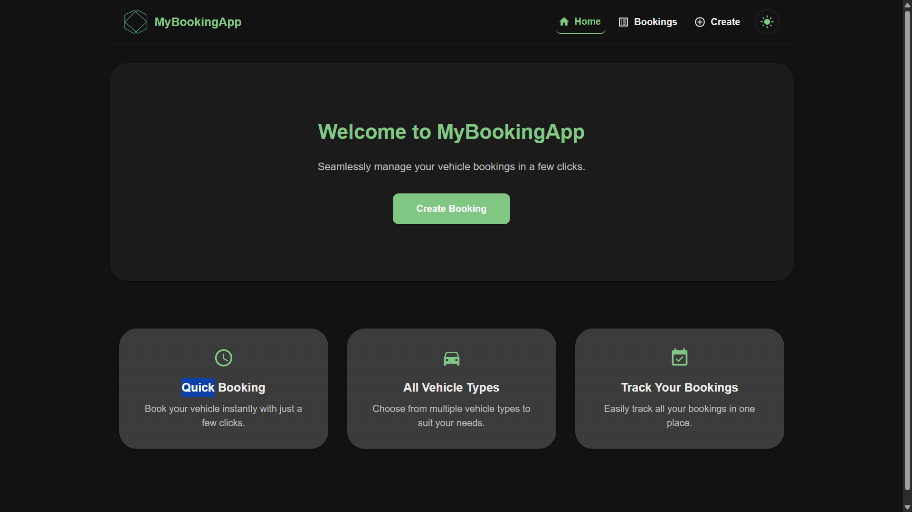
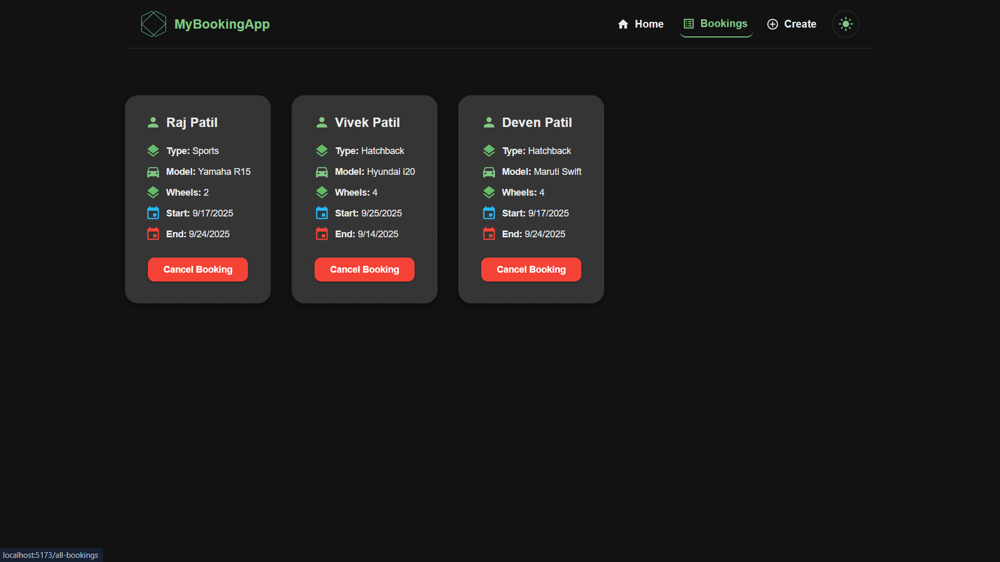
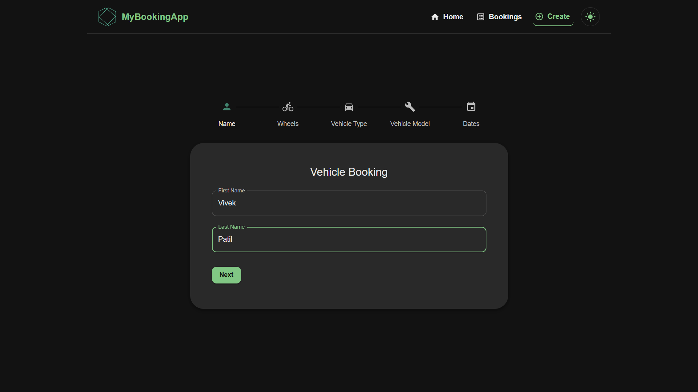
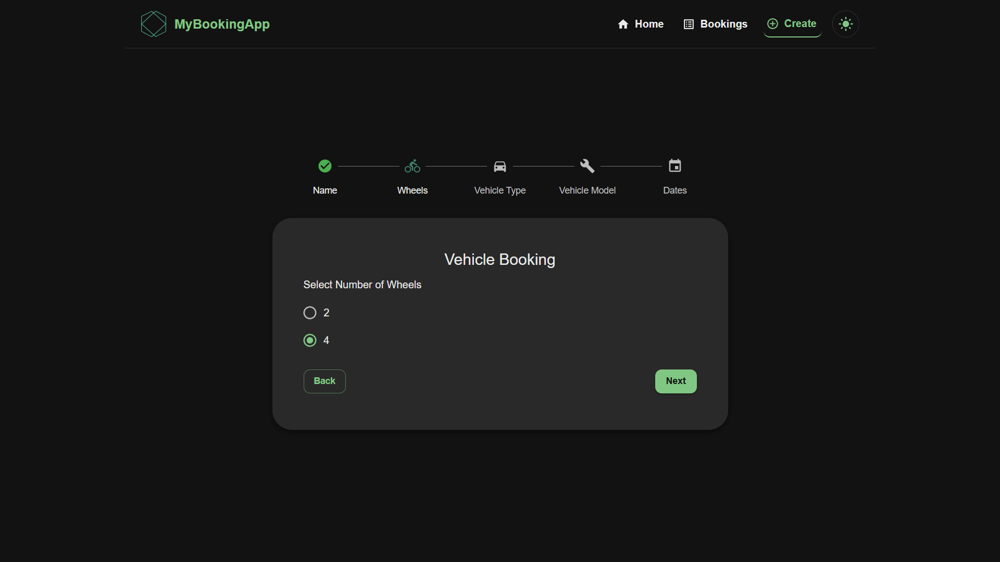
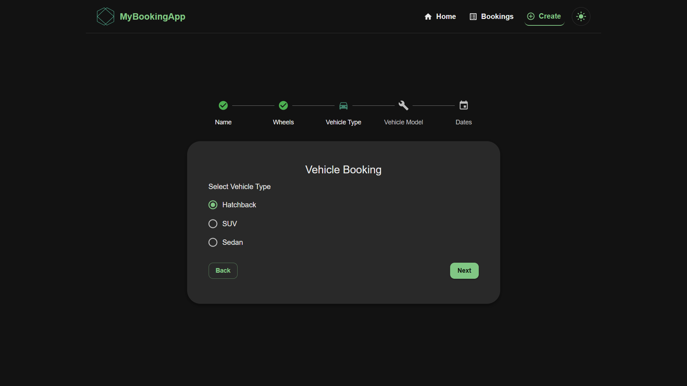
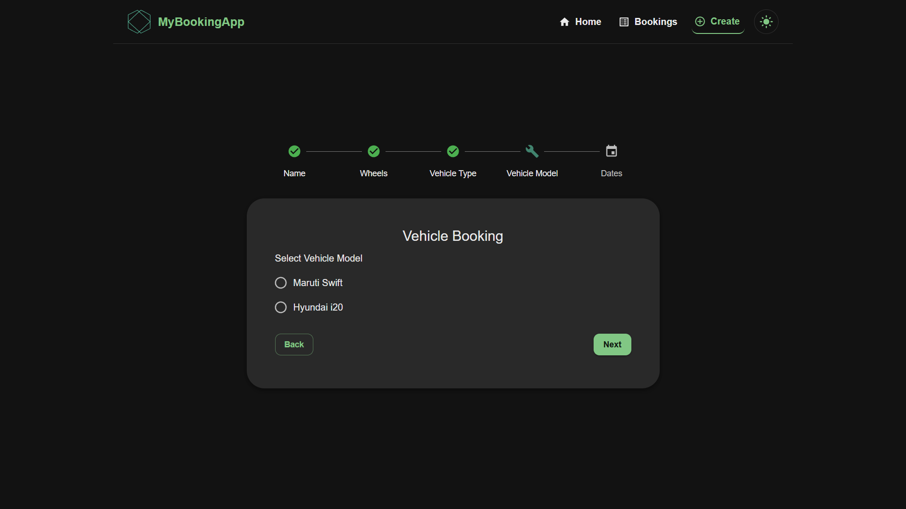
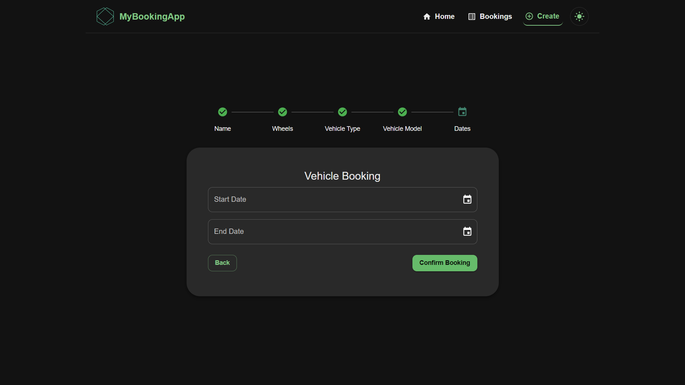

# 🚗 Vehicle Booking Management System

## Octalogic Tech Full Stack Coding Assignment.

* The goal is to design and provide users with a form that collects the user information and data about the vehicle to rent and the dates on which the vehicle is rented.
* A simple full-stack **Vehicle Booking Management System** where users can book vehicles, view all bookings, and manage them easily.

---

## 📂 Project Structure

```
booking-management/
│── backend/               # Node.js + Express backend
│   ├── models/            # Sequelize models (Booking model)
│   ├── routes/            # API routes
│   ├── controllers/       # Booking controller logic
│   ├── seeders/           # Database seeders
│   │   └── seed.js        # Initial seeding script
│   ├── server.js          # Entry point
│
│── frontend/              # React frontend
│   ├── src/
│   │   ├── pages/         # Pages (Home, AllBookings, etc.)
│   │   ├── components/    # Reusable components
│   │   ├── App.js         # Main app
│   │   └── main.jsx       # Entry file
│
│── README.md              # Documentation
│── .env                   # Environment variables
```

---

## 🛠 Tech Stack

### Backend

* **Node.js** + **Express.js**
* **Sequelize ORM** (MySQL/PostgreSQL)
* **REST API**

### Frontend

* **React.js**
* **Material UI** (for theming and components)
* **Axios** (API calls)
* **React Router**
* **SweetAlert2** (UI alerts)

---

## ⚙️ .env File Structure

Create a `.env` file in the **backend** folder:

```env
PORT =5000

MYSQL_USERNAME=
MYSQL_PASSWORD=
MYSQL_DATABASE=octalogic
MYSQL_HOST=localhost
MYSQL_PORT=3306
```

---

## 🌐 API Endpoints

### Booking Routes

| Method | Endpoint             | Description          |
| ------ | -------------------- | -------------------- |
| POST   | `/v1/booking/create` | Create a new booking |
| GET    | `/v1/booking/`    | Get all bookings     |
| DELETE | `/v1/booking/:id`    | Delete booking by ID |

### Vehicle Routes

| Method | Endpoint                       | Description                   |
| ------ | ------------------------------ | ----------------------------- |
| GET    | `/v1/vehicle/`                 | Get number of wheels          |
| GET    | `/v1/vehicle/vehicleType/:id`  | Get vehicle types by wheel ID |
| GET    | `/v1/vehicle/vehicleModel/:id` | Get vehicle models by type ID |

---

## 🗼 Screenshots

### Home Page



### All Bookings Page



### Step 1 - Name Step



### Step 2 - Wheels Step



### Step 3 - Vehicle Type Step



### Step 4 - Vehicle Model Step



### Step 5 - Dates Step



---

## 🚀 Getting Started

### 1️⃣ Clone the repository

```bash
git clone https://github.com/yourusername/booking-management.git
cd booking-management
```

### 2️⃣ Setup Backend

```bash
cd backend
npm install
```

* Create a `.env` file (see structure above).
* Run the seed script:

```bash
npm run seed
```

* Start backend:

```bash
npm start
```

### 3️⃣ Setup Frontend

```bash
cd frontend
npm install
npm run dev
```

### 4️⃣ Open in Browser

- Frontend: [http://localhost:5173](http://localhost:5173)
- Backend: [http://localhost:5000](http://localhost:5000)

---

## ✨ Features

* ✅ Book a vehicle with details
* ✅ Prevent overlapping bookings
* ✅ View all bookings
* ✅ Delete bookings
* ✅ SweetAlert-based confirmation messages

## 👨‍💻 Author  

✨ Developed with passion by **Vivek Patil** 🚀  

🔗 **Portfolio:** [vivek45.vercel.app](https://vivek45.vercel.app/)  
💻 **GitHub:** [github.com/vivekPatil45](https://github.com/vivekPatil45)  
🌐 **LinkedIn:** [Vivek Patil](https://www.linkedin.com/in/vivek-patil-76a563260/)  
